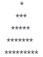

# Problem-4: Print the following pattern based on the given number n (can be any number). 

Sample input: 5  
Sample output:  

## How to solve

1. Take input from the User.
2. Use nested For Loop - one main loop and other 3 loops inside the main loop.
3. Main For Loop will run till user input and the other 3 loops will generate 3 triangles - left, middle and right triangle respectively.
4. Put end of line after all 3 loops are run.
5. Finally get the desired output based on the logic provided.